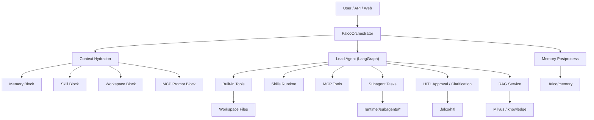

# Falco

Falco 是一个面向本地工作区执行的 Agent Runtime。它把对话式智能体、线程级记忆、技能系统、MCP 工具接入、Human-in-the-Loop 审批、子代理委派，以及本地知识库检索整合到一套统一运行时里，既能作为命令行助手使用，也能通过 FastAPI 和 Next.js Web UI 对外提供服务。

Falco 强调三个落点：

- 面向真实工作区执行，而不是停留在纯聊天层
- 把“记忆、审批、技能、子代理”做成同一套运行时约束
- 用更轻量的方式把本地 RAG、MCP 和服务化接口接到一起

## 系统能做什么

Falco 的核心目标，不是回答一个问题，而是围绕一个线程持续完成任务。

- 维护多轮会话上下文，并将线程记忆持久化到 `.falco/memory`
- 在受控工作区内读取、检索、写入文件，并阻止访问敏感路径
- 在执行高风险动作前发起用户审批或澄清，形成可恢复的 HITL 流程
- 以 Skill 的形式注入领域能力，支持启用、禁用、增删改和运行时执行
- 通过 MCP 动态加载外部工具，把第三方服务纳入统一工具面板
- 通过子代理将复杂任务拆解到独立 worker 目录中并回收结果
- 使用 Milvus + LangChain 构建本地 RAG 检索链路，为回答提供知识库支持
- 通过 API 和 Web UI 暴露统一能力，方便集成到更上层产品

## 适合的使用场景

- 需要在本地仓库或指定工作目录内持续协作的 coding / research agent
- 需要“长期线程 + 可恢复流程 + 可审批写入”的企业或个人助手
- 需要把内部知识库、外部 MCP 服务、文件工具统一编排的实验平台
- 想快速验证 agent runtime 设计，而不是只试一个 prompt loop 的项目

## 核心特性

### 1. 统一编排内核

CLI、FastAPI、Web UI 最终都指向同一个 `FalcoOrchestrator`。这意味着：

- 对话入口不同，但记忆、工具、技能、审批、RAG 的行为保持一致
- 你不需要为“命令行版本”和“服务版本”维护两套 agent 逻辑
- 新增能力时只需要接入 orchestrator 和工具注册层

### 2. 线程级记忆，而不是简单上下文拼接

Falco 的记忆系统并非仅保留最近几轮消息，而是组合了多种层次：

- 最近对话窗口
- LLM 维护的全局摘要
- 重要历史轮次
- 日级沉淀
- evergreen 反思型记忆

这样做的好处是：上下文可控、长线程更稳定，也更适合多阶段任务。

### 3. Human-in-the-Loop 内建到执行流

Falco 把审批和澄清视为运行时的一部分，而不是 UI 层补丁。

- 写文件、索引知识库等动作可以先创建审批请求
- 缺失信息时，agent 会显式创建 clarification request
- 用户回复后可继续 `resume` 原线程，而不是重新开始一轮

这让 Falco 更适合需要安全边界的真实执行场景。

### 4. Skill 作为“可注入能力单元”

Skill 不是静态文档，而是由：

- `SKILL.md` 提示说明
- 可选 `scripts/runtime.py` 执行逻辑

组成的能力单元。Falco 会把已启用的 Skill 注入系统提示，并在需要时执行 Skill runtime。仓库内已经包含 `default_planning` 和 `rag` 两个内置技能。

### 5. 子代理委派有真实落盘协议

很多 agent 项目把 delegation 停留在“再开一个对话”。Falco 更进一步：

- 每个子代理任务都会创建独立 worker 目录
- 任务描述、状态、结果和中间产物都有固定落盘位置
- 主代理通过 `run_subagent_tasks` 和 `read_subagent_result` 回收结果

这种设计让并行拆解、失败恢复和结果审计更清晰。

### 6. 本地 RAG 不是外挂，而是运行时内能力

Falco 已将 RAG 做成一等能力：

- 基于 Milvus 存储向量
- 支持 dense / hybrid 检索模式
- 支持 query planning、子查询扩展、关键词抽取
- 支持 cross-encoder rerank
- 能通过 CLI、Skill、API 三种方式触发

这意味着知识检索并不是“另一个项目”，而是主 agent 的原生工具。

### 7. MCP 扩展友好

Falco 可通过 `.falco/mcp.json` 加载 stdio、SSE、streamable HTTP 等 MCP 服务，并将其工具统一纳入 LangChain tool list。默认支持工具名前缀，减少命名冲突，也便于在 README 或界面中识别工具来源。

## 架构概览



## 运行流程

1. 用户消息进入 orchestrator，并带上 `thread_id`
2. 系统装载该线程的记忆、Skill、MCP 状态和工作区上下文
3. Lead agent 决定直接回答，或继续调用工具 / Skill / 子代理 / RAG / MCP
4. 如果遇到高风险写操作或信息缺失，会中断为审批或澄清请求
5. 当前轮结束后，记忆系统异步做摘要、重要性评分与长期沉淀

## 目录结构

```text
Falco/
├─ cli.py                    # 命令行入口
├─ config.example.yaml       # 配置模板
├─ harness/                  # 核心运行时
│  ├─ agents/                # orchestrator、secretary、memory、subagent、HITL
│  ├─ config/                # 配置加载与校验
│  ├─ mcp/                   # MCP registry
│  ├─ prompts/               # Prompt 模板
│  ├─ skills/                # Skill 管理
│  ├─ tools/                 # 内置工具集
│  ├─ workspace.py           # 工作区路径约束与 thread 目录管理
│  └─ rag_cli.py             # RAG CLI
├─ service/                  # FastAPI 服务
├─ web/                      # Next.js 前端
├─ skills/                   # 公共 Skill
├─ knowledge/                # 知识库样例
├─ mcps/                     # MCP demo / integration 示例
├─ docs/                     # 架构与设计文档
└─ .falco/                   # 运行时数据（记忆、HITL、MCP 配置等）
```

## 快速开始

### 1. 安装 Python 依赖

```bash
pip install -r requirements.txt
```

### 2. 准备配置

```bash
copy config.example.yaml config.yaml
```

然后按你的环境修改这些关键项：

- `model.id` 和 `model.base_url`
- `workspace.root` 与 `workspace.allowed_roots`
- `skills.public_root`
- `rag.*`
- `mcp.*`

### 3. 设置环境变量

Falco 通过环境变量读取密钥。默认配置中会读取：

```bash
LLM_API_KEY=your_key
FALCO_RAG_MILVUS_TOKEN=your_token
```

如果你使用本地兼容 OpenAI 接口的模型服务，也可以只配置 `base_url` 并填入占位 API Key。

## 使用方式

### 命令行模式

```bash
python cli.py
```

CLI 支持会话选择和线程切换，常见命令包括：

- `/sessions`
- `/thread <name>`
- `/mcp`
- `/reload-mcp`
- `quit`

### API 服务

```bash
uvicorn service.app.main:app --host 0.0.0.0 --port 8000 --reload
```

主要接口：

- `GET /api/v1/health`
- `GET /api/v1/mcp/catalog`
- `POST /api/v1/chat`
- `POST /api/v1/chat/stream`
- `POST /api/v1/rag/search`
- `POST /api/v1/rag/index`

### Web 界面

```bash
cd web
npm install
npm run dev
```

默认访问地址：

```text
http://127.0.0.1:1357
```

可通过环境变量指定后端：

```bash
NEXT_PUBLIC_FALCO_API_BASE=http://127.0.0.1:8000
```

## RAG 使用说明

Falco 已把 `rag` 作为内置 Skill 接入，可通过三种方式使用。

### 通过 CLI 建库

```bash
python -m harness.rag_cli index --path knowledge --drop-old
python -m harness.rag_cli search --query "memory design" --top-k 5
```

### 通过 Agent Skill 调用

```text
use_skill(skill_name="rag", action="search", args={"query": "memory design", "top_k": 5})
```

```text
use_skill(skill_name="rag", action="index", args={"path": "knowledge", "drop_old": false})
```

### 通过 API 调用

```bash
curl -X POST http://127.0.0.1:8000/api/v1/rag/search \
  -H "Content-Type: application/json" \
  -d "{\"query\":\"memory design\",\"top_k\":5}"
```

## MCP 集成

在 `config.yaml` 中启用：

```yaml
mcp:
  enabled: true
  config_path: ./.falco/mcp.json
  tool_prefix: true
```

`.falco/mcp.json` 支持两类常见配置：

- `stdio`
- `sse`
- `streamable_http`

典型配置示例：

```json
{
  "servers": {
    "filesystem": {
      "transport": "stdio",
      "command": "npx",
      "args": ["-y", "@modelcontextprotocol/server-filesystem", "."]
    },
    "remote_docs": {
      "transport": "sse",
      "url": "https://example.com/mcp/sse"
    }
  }
}
```

## 工作区与安全边界

Falco 明确区分了几类目录：

- `workspace root`：主工作区
- `uploads:/`：用户上传输入
- `runtime:/`：中间运行时产物，尤其是子代理输出
- `deliverables:/`：面向用户的最终文件

并通过 `WorkspaceManager` 做这些约束：

- 路径必须位于允许根目录内
- `.git`、`.falco`、`node_modules`、`.env`、密钥文件等默认受限
- 写操作可结合审批流执行
- 子代理写入必须留在自己的 worker 目录内

这让 Falco 更像一个“受控执行环境”，而不是任意访问文件系统的脚本拼接器。

## 为什么这个项目有意思

市面上不少 agent 仓库已经证明了“Planner + Tools + Memory”这条路线是成立的，但 Falco 的价值在于，它把几个平时分散实现的模块真正揉到了一起：

- 不是只做 prompt orchestration，而是带工作区约束
- 不是只做 memory，而是把记忆、审批、恢复串进同一条执行链
- 不是只接一个知识库，而是把 RAG 变成原生 Skill
- 不是只喊 multi-agent，而是给出了子代理文件协议和结果回收路径

如果你想研究“一个可以逐步长成产品的 agent runtime 应该长什么样”，Falco 是一个很好的起点。

## 已实现但仍值得继续打磨的方向

- Web UI 目前更偏工程控制台，仍有产品化空间
- RAG 已具备主链路，但 source 管理、状态可视化还可继续完善
- Skill 体系已经可执行，但生态和模板还可以更丰富
- MCP 已支持动态加载，但权限与观测层还可以更精细

## 推荐阅读

- [docs/falco_mvp_architecture.md](docs/falco_mvp_architecture.md)
- [docs/mcp_integration.md](docs/mcp_integration.md)
- [docs/rag_milvus_integration.md](docs/rag_milvus_integration.md)
- [docs/memory_short_term_strategy.md](docs/memory_short_term_strategy.md)
- [docs/service_web_setup.md](docs/service_web_setup.md)

## License

当前仓库未看到明确 License 文件。若计划公开发布，建议补充开源许可证后再对外分发。
